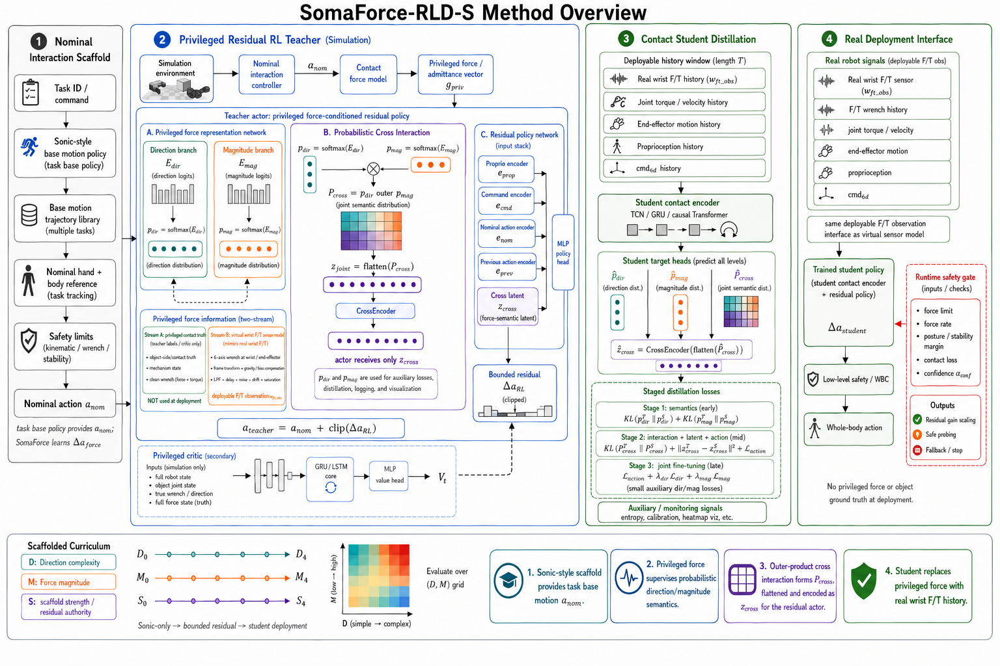

# SomaForce-Cross

> SomaForce-Cross is the implementation route for scaffolded humanoid force adaptation via cross semantic force distillation.

This repository is the standalone engineering baseline for developing SomaForce-Cross from the current selected pipeline. It includes the baseline architecture figure, module contracts, implementation plan, and the first Sonic-based scaffold engineering slice.

Baseline pipeline:



## Current Purpose

This repository should now contain:

- the baseline SomaForce-Cross pipeline;
- module boundary definitions;
- expected input/output contracts;
- implementation milestones;
- Sonic-based scaffold adapters and task trajectory templates;
- notes for Isaac Lab and real F/T integration;
- enough context to continue engineering from a self-contained baseline.

It should not yet contain:

- RL training code;
- policy/model implementations;
- sensor simulation code;
- checkpoints, logs, videos, or generated experiment artifacts.

## Selected Pipeline

```text
Sonic-style task scaffold
  -> nominal action a_nom
  -> virtual wrist F/T observation model
  -> privileged direction/magnitude force semantics
  -> p_dir outer p_mag
  -> P_cross
  -> flatten(P_cross)
  -> CrossEncoder
  -> z_cross
  -> bounded residual actor
  -> a = a_nom + clip(Delta a_force)
  -> student distillation from real wrist F/T histories
```

Current key decisions:

- The scaffold should be Sonic-style or Sonic-based: it provides task base motion and `a_nom`.
- The deployed sensor assumption is a real wrist/end-effector F/T sensor.
- Simulation should model a virtual wrist F/T sensor, not expose perfect contact truth to the deployed actor.
- Direction and magnitude are represented as soft semantic distributions.
- Cross interaction is implemented conceptually as `P_cross = p_dir outer p_mag`, then flattening and encoding into `z_cross`.
- The actor should receive only `z_cross` as the force-semantic latent.
- `p_dir`, `p_mag`, and `P_cross` are retained for auxiliary supervision, student distillation, logging, and visualization.

## Repository Layout

```text
docs/
  implementation_plan.md
  module_contracts.md
  scaffold_development.md
figures/
  somaforce_cross_pipeline.png
configs/
  scaffold/
somaforce_cross/
  scaffold/
scripts/
  verify_scaffold_trajectories.py
  verify_sonic_scaffold_env.py
tests/
```

The current scaffold boundary is:

```text
motion trajectory
  -> Sonic-style scaffold / TrackingCommand
  -> residual_joint_pos_action(...)
  -> a_nom
```

SomaForce-Cross force semantics and bounded residual control are added after
`a_nom`; the scaffold code must not consume privileged force labels.

## Next Step

Next engineering step: export the G1 door/box scaffold trajectories into
Sonic-compatible motion files and bind them into Isaac Lab manager-env variants
for scaffold-only rollout tests.
